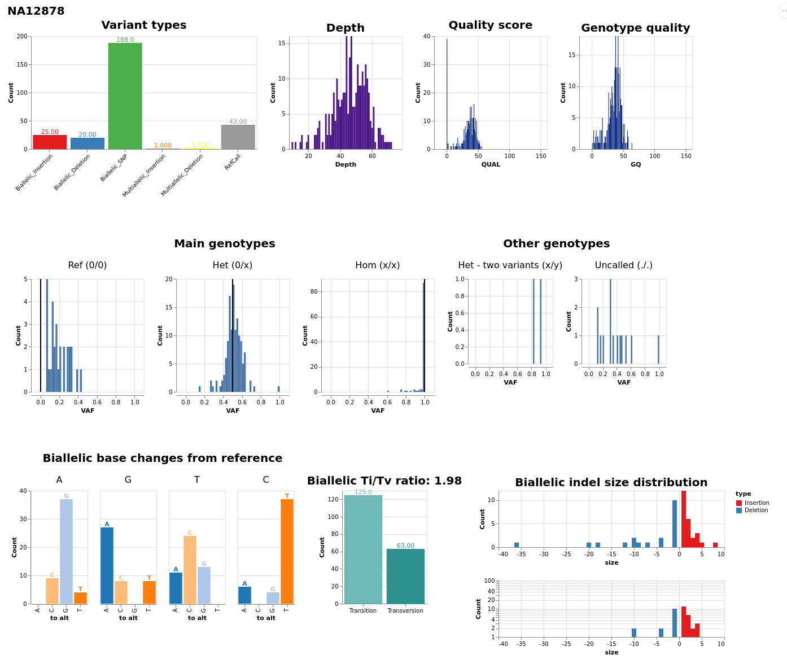

<p align="center">
  
</p>


# Introduction

### Submission Info

For submission info, please see [submission.md](submission.md)

The following steps should provide a fairly complete step by step how-to as to how to run
google's deepvariant project with hypertension journal information. Project proposed by Office Ally,
and is a submission for LA Hacks 2020.

### Notes and Disclaimers:

This project has only been tested with Ubuntu 18.X. It should work fairly as-is with most linux distros, and can certainly be ported to Windows and Mac. However, instructions will be written with linux in mind.

## Step 1: Clone this repo:

```
git clone https://github.com/saresend/deepvariant-challenge
```

## Step 2.1: Installing docker

If you are running on a fresh image, it is possible that you need to install docker. If so, please run the following:

```
sudo apt -y update
sudo apt-get -y install docker.io
```

## Step 2.2: Downloading Sample data (Optional)

The following command will load a truncated dataset provided by google for demonstration purposes. If running on an individual dataset please substitute with that.

```
cd deepvariant-challenge
./load_test_data.sh
```

**Note:** You may need to give this execute privilege by running `chmod +x load_test_data.sh`. If you get issues that say something about about `permission denied`, this is probably the issue.

## Step 3: Running Docker Build

This command will build the image, and also run the analysis on the data provided in the previous steps

```
cd ..
docker build deepvariant-challenge --tag lahacks:0.1
```

## Step 4:

We use this command to instantiate our image, allowing us to collect the data that is the result of the analysis

```
cd deepvariant-challenge
docker run -dit lahacks:0.1
```

## Step 5: Copy output to local machine

### Step 5.1: Get Container Identifier

Please run the following command:

```
docker ps
```

This should provide a list of all your currently running containers. Look for one tagged lahacks:0.1, and find the entry under name. Common ones are things like `mythical_tree`, etc.

### Step 5.2: Copy files from Container

```
docker cp <container_name>:/output .
```

This command will take the output analysis and VCF files, and copy it locally. If all is well, you be able to open a `output.visual_report.html` file in the `output/` directory, and see something like the following:



## Step 6: Run Similarity analysis:

### Step 6.1: Jupyter Notebook installation

For installation instructions for jupyter notebooks, please refer to: https://jupyter.org/install

### Step 6.2: Running The notebook

The following command should analysis the resulting VCF file, and compare it with the data in the journal, loaded as `hypertension_markers.csv`.

This requires you to have jupyter notebook installed, please run:

```
jupyter notebook vcf_compare.ipynb
```

**Note:** This notebook uses `python3`

Inside is some preliminary analysis, and allows for flexibility to play around with the resulting data and conduct additional analysis.

## Full genomic Sequencing

In addition to this small test dataset, we also have the full dataset available. The modifications to run with this dataset are first, instead of running `./load_test_data.sh`, to run `./load_full_genome.sh`, which will pull the entire dataset. Warning: it is about 110 GBs in size. You can then run the following command to build the actual docker container:

```
sudo docker build deepvariant-challenge/ --build-arg ref_file=testdata/hs37d5.fa.gz --build-arg bam_file=testdata/HG002_NIST_150bp_50x.bam --tag lahacks:0.1
```

Otherwise, the commands remain the same and you should be able to produce VCF files for the full genomic sequence, rather than just the test dataset.

## Benchmarks for the project

During development for this project, the following instances were used:

| Instance                      | CPUs | Memory | Success |
| ----------------------------- | ---- | ------ | ------- |
| n1-highmem-32 (GCP)           | 32   | 208 GB | No      |
| standard - 40 (Digital Ocean) | 4    | 160 GB | No      |
| standard - 80 (Digital Ocean) | 6    | 320 GB | No      |

Below is a speed reference for a full genome sequenced by deepvariant, as a sense of how long one might expect this to take for a given instance. It seems that it scales fairly linearly, meaning that we might expect a `32 CPU` machine to run in about double the time of a `64 CPU` machine.

| Step                               | Hardware | Wall time |
| ---------------------------------- | -------- | --------- |
| `make_examples`                    | 64 CPUs  | ~ 1h 46m  |
| `call_variants`                    | 64 CPUs  | ~ 3h 09m  |
| `postprocess_variants` (with gVCF) | 1 CPU    | ~ 53m     |
